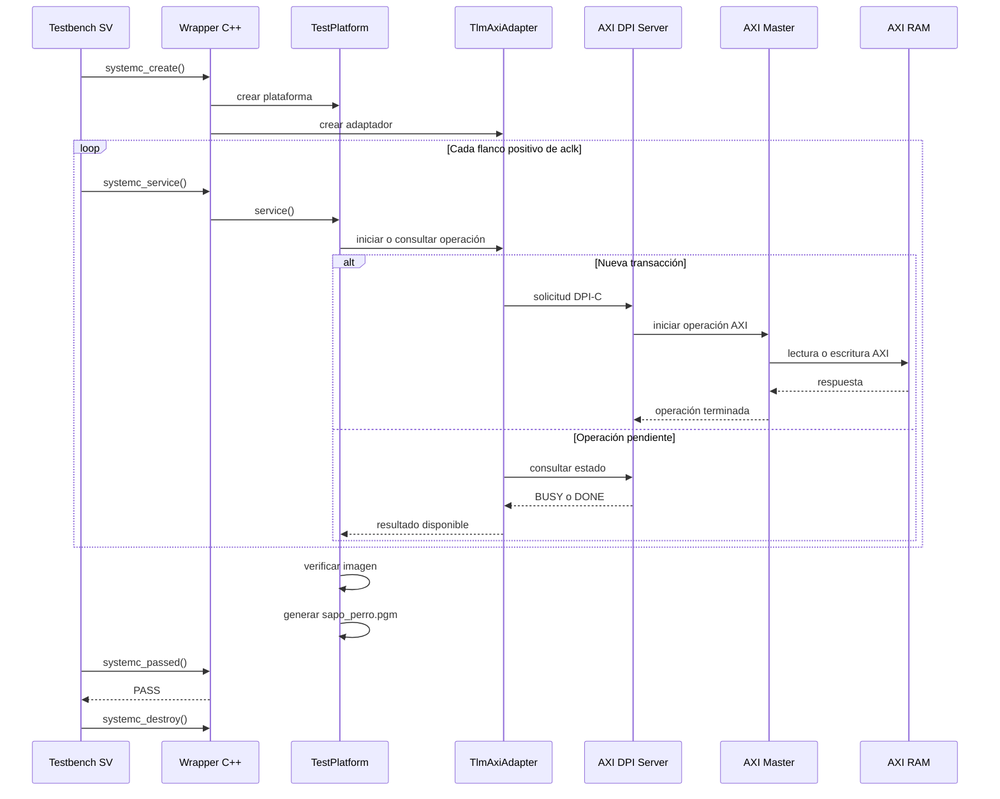

# MP6160 — Tarea 3

**README con contenido técnico explicando:**

- Instrucciones para satisfacer requisitos y compilación.
- Organización del repo.
- Organización de los módulos.
- Diagrama de bloques.
- Diagrama de secuencias.
- Resultados obtenidos.

## Instrucciones para satisfacer requisitos y compilación

**Requisitos**

- Ubuntu 22.04 LTS de 64 bits.
- Vivado Simulator 2024.1.
- Herramientas `xsc`, `xvlog`, `xelab` y `xsim`.
- Bash.
- Archivo de entrada `tarea3_integracion/input/sapo_perro.rgb`.
- Al menos 2 GB de memoria RAM disponibles para la simulación completa.

El archivo de entrada debe ser una imagen RGB intercalada de 8 bits por canal, sin cabecera, con resolución de 1920 × 1080 píxeles:

```text
1920 × 1080 × 3 = 6 220 800 bytes
```

**Preparación del entorno**

Desde la raíz del repositorio:

```bash
cd tarea3_integracion
source /tools/Xilinx/Vivado/2024.1/settings64.sh
```

Verifique las herramientas:

```bash
which xsc xvlog xelab xsim
```

Asigne permisos de ejecución:

```bash
chmod +x scripts/run_cosim.sh
chmod +x scripts/run_image_cosim.sh
```

**Prueba corta de integración**

```bash
./scripts/run_cosim.sh
```

Resultado esperado:

```text
[TEST] Salida gris: 0 255 54 182
[TEST] ACCELERATOR_ADAPTER_PASS
```

**Procesamiento de la imagen completa**

```bash
./scripts/run_image_cosim.sh
```

El script realiza:

- verificación del archivo RGB;
- creación de la carpeta de compilación;
- compilación C++ con `xsc`;
- compilación SystemVerilog con `xvlog`;
- elaboración con `xelab`;
- ejecución con `xsim`;
- generación de `output/sapo_perro.pgm`.

Para verificar la salida:

```bash
ls -lh output/sapo_perro.pgm
file output/sapo_perro.pgm
```

---

## Organización del repositorio

```text
MP6160_grupo_5-tarea3/
├── README.md
├── tarea3_integracion/
│   ├── include/
│   │   ├── test_platform.h
│   │   ├── tlm_axi_adapter.h
│   │   └── dpi_memory_bridge.h
│   ├── src/
│   │   ├── systemc_dpi_wrapper.cpp
│   │   ├── tlm_axi_adapter.cpp
│   │   ├── accelerator_cosim_top.cpp
│   │   ├── dpi_bridge.cpp
│   │   ├── dpi_memory_bridge.cpp
│   │   └── test_*.cpp
│   ├── sv/
│   │   ├── tb_systemc_dpi_step_launcher.sv
│   │   ├── axi_dpi_server.sv
│   │   ├── dpi_axi_master.sv
│   │   └── tb_*.sv
│   ├── scripts/
│   │   ├── run_image_cosim.sh
│   │   ├── run_cosim.sh
│   │   └── run_hola.sh
│   ├── input/
│   │   └── sapo_perro.rgb
│   ├── output/
│   │   └── sapo_perro.pgm
│   ├── build_image_cosim/
│   └── build_cosim_final/
├── tarea3_rtl/
│   └── rtl/
│       └── axi4_ram.sv
└── tarea3_vp/
    └── vp_accel/
        ├── accelerator.h
        ├── rgb_to_gray.h
        └── sc_rgb2gray.hh
```

- `tarea3_integracion` contiene la integración C++/DPI-C/SystemVerilog.
- `tarea3_rtl` contiene la memoria AXI RTL.
- `tarea3_vp` contiene el modelo del acelerador y la función de conversión.
- `input` contiene la imagen RGB original.
- `output` contiene la imagen PGM generada.
- Las carpetas `build_*` son creadas por los scripts de compilación.

---

## Organización de los módulos

**`tb_systemc_dpi_step_launcher.sv`**

- Genera el reloj AXI.
- Aplica el reset.
- Crea el controlador C++.
- Llama `systemc_service()` en cada flanco positivo.
- Consulta el estado final de la prueba.
- Finaliza la simulación.

**`axi_dpi_server.sv`**

- Contiene el maestro AXI y la memoria AXI.
- Exporta las funciones DPI-C de lectura y escritura.
- Mantiene los estados `IDLE`, `BUSY` y `DONE`.
- Configura una RAM de 16 MiB.

**`dpi_axi_master.sv`**

- Convierte las solicitudes DPI-C en transacciones AXI.
- Controla los canales de lectura y escritura.
- Espera las señales de aceptación y respuesta.

**`axi4_ram.sv`**

- Implementa la memoria AXI RTL.
- Almacena la imagen RGB y la imagen gris.
- Atiende las transacciones generadas por el maestro AXI.

**`systemc_dpi_wrapper.cpp`**

- Exporta `systemc_create()`.
- Exporta `systemc_service()`.
- Exporta `systemc_is_finished()`.
- Exporta `systemc_passed()`.
- Exporta `systemc_destroy()`.

**`TlmAxiAdapter`**

- Inicia lecturas y escrituras de 32 bits.
- Consulta el estado de las operaciones.
- Recupera los datos de lectura.
- Permite avanzar la integración sin bloquear el reloj de SystemVerilog.

**`TestPlatform`**

- Abre y valida `sapo_perro.rgb`.
- Carga la imagen en la RAM AXI.
- Calcula la imagen gris.
- Escribe la salida en otra región de memoria.
- Lee nuevamente la salida.
- Verifica todos los píxeles.
- Genera `sapo_perro.pgm`.

**`rgb_to_gray.h`**

- Contiene la conversión RGB a escala de grises basada en BT.709.
- Produce valores enteros entre 0 y 255.

---

## Diagrama de bloques

```text
                           +----------------------------------+
                           |         Testbench XSim           |
                           | tb_systemc_dpi_step_launcher.sv  |
                           |        (SystemVerilog)           |
                           +----------------+-----------------+
                                            |
                                            | DPI-C
                                            v
                           +----------------------------------+
                           |     systemc_dpi_wrapper.cpp      |
                           | create / service / destroy /     |
                           |   is_finished / passed           |
                           +----------------+-----------------+
                                            |
                                            v
                           +----------------------------------+
                           |          TestPlatform            |
                           |     Control cooperativo C++      |
                           +----------------+-----------------+
                                            |
                    +-----------------------+-----------------------+
                    |                                               |
                    v                                               v
       +----------------------------+                 +----------------------------+
       |   input/sapo_perro.rgb     |                 |  output/sapo_perro.pgm    |
       | Imagen RGB 1920 x 1080     |                 | Imagen gris generada      |
       +-------------+--------------+                 +----------------------------+
                     |
                     v
           +----------------------------------+
           |         rgb_to_gray()            |
           | Conversión RGB a escala de gris  |
           +----------------+-----------------+
                                            |
                                            | solicitudes de lectura/escritura
                                            v
                           +----------------------------------+
                           |         TlmAxiAdapter            |
                           |        Puente C++ / DPI          |
                           +----------------+-----------------+
                                            |
                                            | DPI-C
                                            v
                           +----------------------------------+
                           |         axi_dpi_server.sv        |
                           |      Servidor AXI por DPI-C      |
                           +----------------+-----------------+
                                            |
                                            v
                           +----------------------------------+
                           |         dpi_axi_master.sv        |
                           |         Maestro AXI RTL          |
                           +----------------+-----------------+
                                            |
                                            | AXI4
                                            v
                           +----------------------------------+
                           |           axi4_ram.sv            |
                           |         Memoria RTL 16 MiB       |
                           +----------------------------------+
```

La arquitectura utiliza SystemVerilog como responsable del reloj y del avance de la simulación. El controlador C++ se comunica con el servidor AXI mediante funciones DPI-C de tiempo cero. Las transacciones son ejecutadas por el maestro AXI sobre la memoria RTL, donde se almacenan la imagen RGB de entrada y los datos en escala de grises.

---

## Diagrama de secuencias



---

## Resultados obtenidos

**Prueba corta**

```text
[TEST] Salida gris: 0 255 54 182
[TEST] ACCELERATOR_ADAPTER_PASS
```

**Imagen completa**

```text
[IMAGEN] Resolucion: 1920x1080
[IMAGEN] Bytes RGB: 6220800
[PROGRESO] Cargando RGB en RAM: 1555200/1555200 palabras (100 %)
[PROGRESO] Escribiendo gris en RAM: 518400/518400 palabras (100 %)
[PROGRESO] Leyendo gris desde RAM: 518400/518400 palabras (100 %)
[TEST] Pixeles verificados: 2073600/2073600
[TEST] IMAGE_AXI_LOAD_PASS
```

- Resolución procesada: 1920 × 1080 píxeles.
- Datos RGB cargados: 6 220 800 bytes.
- Píxeles verificados: 2 073 600.
- Coincidencia obtenida: 100 %.
- RAM AXI utilizada: 16 MiB.
- Archivo generado: `output/sapo_perro.pgm`.
- Tamaño del archivo PGM: 2 073 617 bytes.
- Tiempo de simulación XSim: 181 440 075 ns.
- Tiempo real registrado: aproximadamente 1 minuto y 3 segundos.
- Resultado final: `IMAGE_AXI_LOAD_PASS`.

---

## Declaración sobre el uso de Inteligencia Artificial

Durante el desarrollo de este proyecto se utilizaron herramientas de Inteligencia Artificial como apoyo técnico para:

- Revisar errores de compilación y mensajes generados por Vivado XSim.
- Apoyar la depuración de la integración entre C++, DPI-C, SystemVerilog y AXI.
- Realización de pruebas aisladas para integración de código.
- Revisar la organización del flujo de compilación y simulación.
- Interpretar resultados de las pruebas y registros de ejecución.
- Apoyar la redacción y organización de la documentación técnica.
- Apoyar la elaboración de los diagramas de bloques y de secuencias.


Las herramientas de Inteligencia Artificial se utilizaron únicamente como apoyo durante el desarrollo. Todas las decisiones de diseño, implementación, integración, validación y verificación fueron revisadas por los integrantes del equipo antes de incorporarlas al proyecto.

