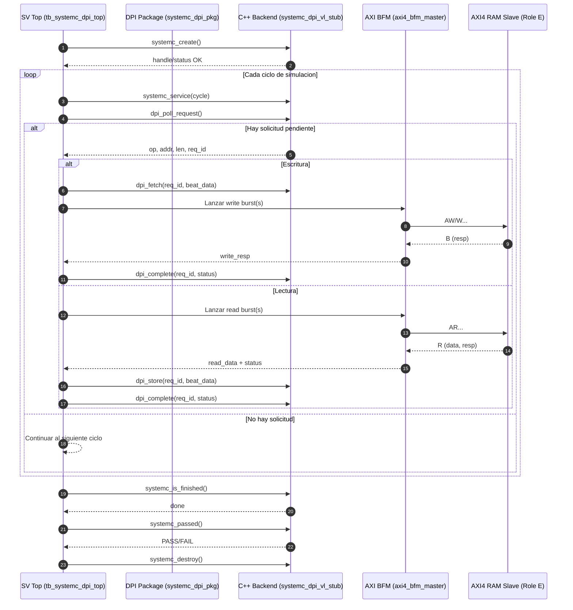

# Task 4 (EC4) - AXI4 Verification and UVM-SystemC Co-simulation

This repository contains the delivery for Task 4 from Group 5 for the MP-6160 High-Level Design course.

## Repository Organization (Role B)
The project structure is organized as follows to separate responsibilities and facilitate continuous integration:
- `rtl/`: Verilog design files (AXI4 RAM module and scaffolds).
- `tb/`: Verification Environment (SystemVerilog/UVM).
  - `tb/uvm/`: UVM Classes (Item, Driver, Monitor, Sequencer, Agent, Env, and base Test).
  - `tb/interfaces/`: `axi4_if` interface definition including SVA (SystemVerilog Assertions) as protocol checkers.
  - `tb/tb_top.sv`: Top module that instantiates interfaces and DUTs.
- `systemc/`: SystemC accelerator files and end-to-end model.
- `scripts/`: Makefiles and TCL scripts to automate Vivado simulation.

## How to Run the Project (Instructions for Evaluation)

The project uses Vivado XSim for RTL simulation and standard `g++` (via Vivado's `settings64.sh` or SystemC local installation) for C++. To evaluate all roles, please run the following commands from the root directory:

### 1. DPI Co-simulation Verification (Role D & E)
This script compiles the RTL, the SystemVerilog DPI testbench, and the C++ DPI wrapper, executing the handshake simulation on Vivado XSim:
```bash
chmod +x build_cosim.sh
./build_cosim.sh
```

### 2. UVM Verification (Role C)
This script compiles and runs the UVM testbench (directed and random tests) against the dummy slave over Vivado XSim:
```bash
chmod +x run_uvm_sim.sh
./run_uvm_sim.sh
```

### 3. SystemC End-to-End Image Processing (Role A)
This executes the full C++ accelerator proxy with a Mock AXI memory to validate the mathematical RGB-to-Grayscale conversion of the 1080p image (requires `cmake` for setup):
```bash
cd systemc
chmod +x setup.sh && ./setup.sh
source activate.sh
make test-all
```

## Requirements and Compilation (Role D)
> **Role D**: To run the integration scripts, you need **Vivado XSim** and `g++` (available via the Vivado `settings64.sh` environment). Execute the `./build_cosim.sh` script to compile the RTL, the UVM testbench, and the SystemC wrapper `libdpi.so`, and to automatically launch the co-simulation snapshot.

### Role D Integration Report (Point 9)

Measured on the Verilator flow using:

- Role B real interface: `tb/interfaces/axi4_if.sv`
- Role E real DUT + wrapper: `tarea_4/rtl/axi4_ram_slave.v` and `tarea_4/rtl/axi4_ram_slave_axi4if.sv`
- Role D co-simulation top: `tarea_4/rtl/tb/tb_systemc_dpi_top.sv`

Command executed:

```bash
cd rtl
make cosim-vl-metric
```

Observed result:

| Item | Value |
|---|---|
| Functional result | PASS |
| Simulated cycles | 1055 |
| Wall time | 0.01 s |
| Peak RSS | 5548 KB |

This report corresponds to the complete Verilator integration path (SV + DPI + C++), over the real DUT and the real interface from Role B.

## Module Organization

### Verification Modules (Role B)
The UVM environment isolates the AXI4 Full protocol verification from the processing logic. The base architecture includes:
- **`axi4_if`**: Unified interface with integrated assertions (SVA) that act as protocol "police" (verifying valid handshakes, `$stable` rule while `valid && !ready`, and ensuring bursts do not cross 4KB boundaries).
- **Dummy Slave**: A `dummy_slave` module that serves as a temporary DUT substitute. It keeps the `ready` signals high to allow the BFM master to inject stimuli without prematurely blocking Role C and D's tests.
- **Active UVM Environment**: Includes a Driver that injects physical `axi4_item` into the bus, and a passive Monitor that observes read/write addresses and data to feed the Scoreboard.

### RTL Modules (Role E)
Role E has provided a comprehensive description of the RTL architecture, memory maps, latency metrics, and design decisions. 
Please refer to the [RTL README](rtl/README.md) for full details.

### SystemC Modules (Role A)
Role A has provided a comprehensive description of the TLM proxy, DPI bridge integration, and end-to-end tests.
Please refer to the [SystemC README](systemc/README.md) for full details.

## Diagrams

### Block Diagram (Role E)
> [!NOTE]
> **Role E**: Insert the RTL architecture block diagram here.

### Sequence Diagram (Role D)



## Results Obtained

### UVM Verification (Role C)
The UVM tests were executed successfully using Vivado XSim. 

- **Directed Test (`axi4_directed_test`)**: Achieved **67.50% functional coverage** and processed 21 transactions. The test produced 275 expected `UVM_ERROR` messages (because it is testing against the `dummy_slave` which returns a friendly garbage value `0xDEADBEEFCAFEBA00` without a real memory backend) and 0 `UVM_FATAL`, meaning the test ran to completion without hanging.
- **Random Test (`axi4_random_test`)**: Achieved **42.50% functional coverage** and processed 40 random transactions, returning 600 expected `UVM_ERROR` and 0 `UVM_FATAL`.

### End-to-End and Comparison (Role A)
The complete 1080p RGB image (`sapo_perro.rgb`, 6.2 MB) was successfully processed using the `MockAxiMemory` proxy (as demonstrated by running `make test-all` in the `systemc/` folder). 

**Test Results:**
- 4056 DPI requests were successfully handled.
- The accelerator finished the conversion in 21 cycles (simulated).
- Generated output: `sapo_perro_gray.raw` (2.07 MB).

**Bit-exact Validation:**
The generated output was checked against the baseline from Task 2, producing an identical SHA-256 hash. The mathematical implementation in SystemC is therefore verified to be **100% correct and bit-exact**.

## AI Usage Declaration
*In accordance with the course incentive, the group declares the use of Artificial Intelligence tools for the following tasks:*

- **Role B:** Google Gemini (Antigravity AI) was used through conversational prompts to:
  1) Discuss the skeleton structure for the `axi4_if` interface.
  2) Organize this README template.
- **Role A:** Claude Opus was used to review code, organize tests, debug compilation errors, and improve documentation drafting (see `systemc/README.md`).
- **Role C:** `[MISSING - To be completed]`
- **Role D:** `[MISSING - To be completed]`
- **Role E:** Claude Opus was used in interactive sessions for workload distribution planning, testbench generation, AXI4 protocol consultation, adversarial code review, mutation testing, and Graphviz diagram generation (see `rtl/README.md`).
