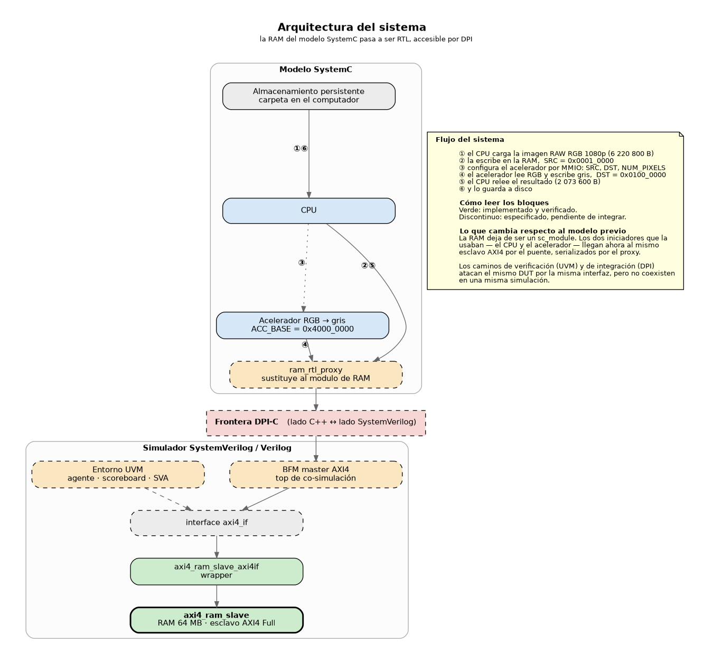
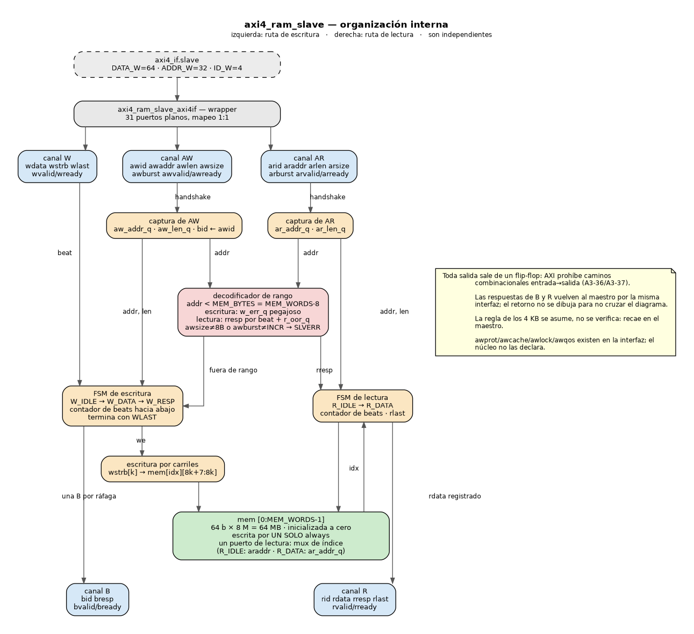
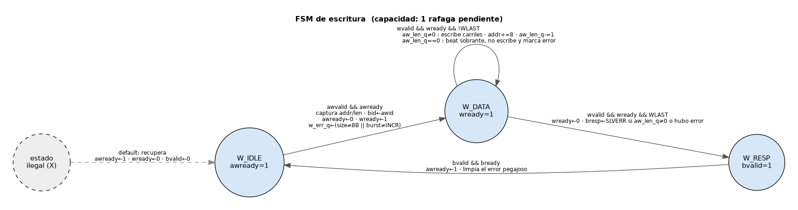
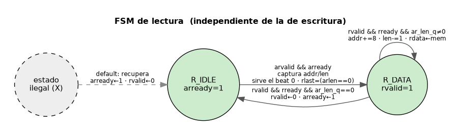

# RAM con puerto esclavo AXI4 Full — organización de módulos (RTL)

Sección del rol **E** para el README de la Tarea 4 (EC4). Cubre el DUT: la memoria de 64 MB con su
puerto esclavo AXI4 Full, su wrapper hacia la `axi4_if`, y el banco de pruebas con el que se
verificó.

> **Aviso sobre el banco de pruebas de este directorio.** El testbench que hay en `tb/` **no es el
> testbench UVM que pide el enunciado**: es el banco de *bring-up* con el que se desarrolló y verificó
> este módulo, escrito en Verilog procedimental porque en la máquina de trabajo no hay ninguna
> librería UVM disponible (ver §8). El **testbench UVM/SystemVerilog vive en su propio directorio**.
> Los dos atacan el mismo DUT y cumplen funciones distintas: este demuestra que el módulo funciona;
> aquel es el entregable de verificación.

---

## 1. Alcance

Lo que el módulo **implementa y verifica**:

| | |
|---|---|
| Anchos | `DATA_W=64`, `ADDR_W=32`, `ID_W=4` · un solo ID (`id=0`) · reloj 100 MHz |
| Reset | `aresetn` activo bajo, **síncrono**, mínimo 16 ciclos |
| Ráfagas | `INCR`, `AWLEN`/`ARLEN` = 0..255 (es decir, **1..256 beats**) |
| Tamaño | `AWSIZE`/`ARSIZE` = `3'b011` (8 bytes por beat) |
| Escrituras parciales | `WSTRB` completo, un bit por carril de byte |
| Respuestas | **en orden**, `OKAY` y `SLVERR` |
| Capacidad | 1 escritura + 1 lectura pendientes, **independientes entre sí** |

Fuera de alcance, y por qué no rompe nada: `WRAP` y `FIXED` (se responden con `SLVERR`, no se
interpretan como `INCR`), *out-of-order* (hay un solo ID) y *narrow transfers* (`size` ≠ 8 B también
da `SLVERR`).

La regla de los 4 KB se asume, no se verifica. La especificación impone esa restricción a la
*ráfaga*, que la genera el master, y uno de sus dos motivos declarados es precisamente limitar el
tamaño del incrementador de dirección *del esclavo*. Quien la verifica es el *checker* SVA del entorno de
verificación, del lado del maestro. Lo que sí hace este esclavo es no aliasar cuando la regla se viola: si un
beat cae fuera de rango, un indicador pegajoso hace que todos los beats siguientes de esa ráfaga
respondan `SLVERR` y devuelvan ceros, aunque la suma de direcciones envuelva en 2³² y "vuelva" a caer
dentro del mapa. Sin ese indicador, una ráfaga que cruzara los 4 GB devolvería datos reales de la
memoria baja con `OKAY`.

---

## 2. Archivos

| Ruta | Qué es |
|---|---|
| `axi4_ram_slave.v` | **El entregable.** Núcleo en Verilog-2001, puertos planos. |
| `axi4_ram_slave_axi4if.sv` | Wrapper: conecta la `axi4_if` del entorno de verificación a los puertos planos. |
| `tb/tb_setup.vh` | Declaraciones del bus + instancia del DUT + inclusión del arnés y el BFM. |
| `tb/tb_common.vh` | Reloj, reset, watchdog, `expect_*`, checker de reset, informe final. |
| `tb/axi4_master_bfm.vh` | Master AXI4 mínimo: tasks de ráfaga, modelo de referencia, checkers. |
| `tb/tb_stage0..8_*.v`, `tb/tb_stage10_agujeros.v`, `tb/tb_stage11_zonasciegas.v` | Las once pruebas de Icarus, una por concepto del protocolo. |
| `tb/tb_stage9_wrapper.sv` | Prueba del wrapper (corre bajo Verilator, ver §8). |
| `tb/stub/axi4_if_stub.sv` | **Provisional.** Sustituto de la `axi4_if` hasta que exista la definitiva. Se borra entonces. |
| `doc/diagrama_arquitectura.*` | Diagrama de bloques de la **arquitectura del sistema** (entregable del enunciado). |
| `doc/diagrama_bloques.*`, `doc/fsm_*.*` | Organización interna del módulo y sus dos máquinas de estados. |
| `rtl.f`, `rtl_if.f` | *Filelists* para que B, C y D compilen el DUT desde sus propios flujos. |
| `Makefile` | **El script de simulación de este módulo.** Compila, corre las doce etapas, mide, genera ondas y regenera los diagramas. Objetivos en §8. |

### Por qué el núcleo es Verilog plano y el wrapper va aparte

Tres razones, y las tres importan:

1. El enunciado pide el módulo **en Verilog**; un `.v` de Verilog-2001 no admite discusión.
2. La `axi4_if` **no existía** cuando se escribió el núcleo. Con puertos planos, el desarrollo no
   dependió de que apareciera.
3. Si B renombra una señal, **solo cambia el wrapper** (unas 40 líneas). El núcleo y las once
   pruebas siguen siendo válidos sin tocar una línea.

---

## 3. Parámetros

| Parámetro | Valor de entrega | En los tests | Para qué |
|---|---|---|---|
| `DATA_W` | 64 | 64 | Ancho del bus de datos. 6 220 800 y 2 073 600 son divisibles entre 8: no hay *beats* parciales. |
| `ADDR_W` | 32 | 32 | Ancho de dirección. |
| `ID_W` | 4 | 4 | Ancho de ID. El proyecto usa un solo ID (`0`). |
| `MEM_WORDS` | 8 388 608 | 1024 / 8192 | Palabras de 64 b. **Es el único parámetro de tamaño**, y el límite de `SLVERR` se deriva de él. |

El límite se **deriva** a propósito: `MEM_BYTES = MEM_WORDS * 8`. Si fuera la constante fija
`0x03FFFFFF` mientras el arreglo se encoge para los tests, una lectura *dentro* del rango declarado
pero *fuera* del arreglo devolvería `X`, y el test de `SLVERR` pasaría por la razón equivocada.

---

## 4. Mapa de memoria y regla de SLVERR

```
0x0000_0000 .. 0x03FF_FFFF   RAM, 64 MB          (MEM_BYTES = MEM_WORDS * 8)
0x0400_0000 .. 0xFFFF_FFFF   fuera de rango  ->  SLVERR
```

Direcciones que usa el sistema de la EC2, para referencia: trabajo sintético 8×8 en
`SRC=0x0000_0000` / `DST=0x0200_0000`, imagen 1080p en `SRC=0x0001_0000` / `DST=0x0100_0000`. Los
registros del acelerador viven en `ACC_BASE = 0x4000_0000` y **no** los decodifica este módulo.

Comportamiento ante error, y por qué: un esclavo que responde error **debe completar el
protocolo igual** — consumir todos los beats de escritura y emitir exactamente una `B`, o emitir los
`ARLEN+1` beats de lectura con su `RLAST`. La especificación es explícita: *"the required number of
data transfers must be performed, even if an error is reported… The remainder of the burst is not
cancelled if the slave gives a single error response"*. Colgar el bus congelaría la regresión de los
la regresión de verificación y el end-to-end del sistema, así que **devolver un `BRESP` imperfecto es
negociable; colgarse no lo es**.

- Escritura: hay una sola `BRESP` para toda la ráfaga, así que el error se acumula
  ("pegajoso"): basta un beat fuera de rango para que la respuesta sea `SLVERR`. En una ráfaga
  parcialmente fuera de rango, **los beats anteriores al primero que cae fuera sí se escriben**, y a
  partir de ahí no se escribe nada más aunque alguno volviera a caer dentro. Con `INCR` monótona las
  dos formulaciones coinciden, pero el *scoreboard* necesita la precisa. (Es lo que hacen
  los esclavos reales; "no escribir nada" también sería legal, pero hay que elegir una y decirlo.)
- Lectura: cada beat lleva su propia `RRESP`, así que una ráfaga a caballo de la frontera
  devuelve `OKAY` en los beats de dentro y `SLVERR` en los de fuera. Los datos fuera de rango se
  devuelven como ceros, nunca `X`.
- `SLVERR` y no `DECERR`: la dirección llega al esclavo (no hay *interconnect* que la rechace);
  `SLVERR` es el código para "el acceso llegó bien pero el esclavo devuelve una condición de error".
- Transacción no soportada (`awsize` ≠ 8 B, `awburst` ≠ `INCR`): `SLVERR`, sin escribir nada. La
  especificación lista *"unsupported transfer size attempted"* como caso típico de `SLVERR`. La
  alternativa —tratarla como `INCR` en silencio— haría que una secuencia aleatoria
  corrompiese memoria sin hacer ruido, y el fallo reaparecería días después como "la imagen salió
  corrida", culpando al puente DPI.

### Direcciones no alineadas

El esclavo soporta ráfagas `INCR` con dirección de arranque no alineada, tal como las define la
especificación: la dirección del beat *n* es `Aligned_Address + n × 8`, donde `Aligned_Address` es la
de arranque redondeada hacia abajo a 8 bytes. El primer beat cae en la palabra alineada y **es el
master quien debe poner en `WSTRB` solo los carriles válidos**.

Verificado: una escritura en `0x0004` con `AWSIZE=8B` y `WSTRB=0xF0` modifica únicamente los cuatro
bytes altos de la palabra 0, y el segundo beat va a `0x0008`. Lo que **no** es legal —y el esclavo no
lo detecta— es arrancar sin alinear y poner `WSTRB=0xFF`: el master estaría declarando válidos bytes
que no lo son, y el resultado es que se escribe la palabra entera. Un generador de secuencias
aleatorias debe restringir `WSTRB` en consecuencia.

---

## 5. Contrato de handshake que el DUT garantiza

- Toda salida sale de un flip-flop. No hay ni un camino combinacional de entrada a salida, como
  exige la especificación (*"there must be no combinatorial paths between input and output signals"*,
  AMBA AXI A3-36/A3-37). Ninguna herramienta comprueba esto: es disciplina de escritura.
- `valid` nunca depende de `ready`, en ningún canal. `bvalid` no mira `bready` y `rvalid` no mira
  `rready`.
- Durante reset, `BVALID` y `RVALID` valen 0, como exige la especificación. Como el reset es
  síncrono, además se inicializan en su declaración: si no, valdrían `X` hasta el primer flanco, y
  `X` no es LOW.
- `AWREADY` y `ARREADY` arrancan en 1 tras reset. Es legal y ahorra un ciclo por transacción.
- Una `B` por cada `AW`, con `BID` ecoando `AWID`. La excepción es que un reset aborte la
  transacción en vuelo: entonces no hay `B`, y eso es lo correcto.
- La ráfaga de escritura termina con `WLAST`, no con el contador interno. La especificación impone la
  dependencia —*"The slave must also wait for WLAST to be asserted before asserting BVALID"*— pero
  permite calcular el último beat desde `AWLEN`; derivarlo de `WLAST` es decisión de este diseño.
  El motivo es práctico: terminar por el contador deja beats huérfanos en el bus cuando el maestro
  manda de más, y esos beats se escriben al principio de la ráfaga siguiente. El contador se usa para
  detectar la discrepancia: si `WLAST` no cae en el beat `AWLEN`, la respuesta es `SLVERR`. El precio
  de esta elección está en §11.
- `RLAST` va en el beat `ARLEN`, y el conteo de beats lo fija `AxLEN`, nunca `WSTRB`. No existe
  terminación temprana: un beat con `WSTRB=0` no escribe nada pero cuenta igual.
- `AWREADY` baja mientras se drena una ráfaga. Es consecuencia de esta implementación (capacidad 1),
  no una regla de AXI: un esclavo con dos transacciones pendientes podría dejarlo alto.
- Las rutas de lectura y escritura no se bloquean entre sí: pueden estar las dos en vuelo.

---

## 6. Diagramas

Hay dos diagramas de bloques y responden a cosas distintas del enunciado:

- El de **arquitectura** es el entregable *"diagrama de bloques de la arquitectura propuesta"*:
  enseña el sistema entero y dónde encaja este módulo.
- El de **módulo** responde a *"organización de los módulos"*: enseña las tripas del esclavo.

### Arquitectura del sistema



En verde, lo implementado y verificado en este directorio. Con línea discontinua, lo que está
especificado y acordado pero todavía no integrado: el diagrama refleja la arquitectura del sistema,
no el estado de avance de cada pieza.

### Organización interna del módulo



Se lee en dos columnas: a la izquierda la ruta de escritura y a la derecha la de lectura. No es una
elección estética — las dos rutas son de verdad independientes en el RTL (§5), y dibujarlas
entrelazadas sugeriría un acoplamiento que no existe. Lo único que comparten es el decodificador de
rango, en el centro, y la memoria.

Dos cosas que el diagrama omite a propósito: los canales `B` y `R` no dibujan su retorno al maestro
(vuelven por la misma interfaz, y trazarlo cruzaba la figura entera), y el mux del índice de lectura
aparece dentro de la caja de la memoria en vez de como bloque aparte, que es donde el concepto se
entiende: la memoria tiene **un solo puerto de lectura** y ese mux es lo que lo hace posible.

### Las dos máquinas de estados





El estado dibujado con línea discontinua no es alcanzable desde el bus: es la rama `default`, que
existe para recuperarse de una propagación de `X` en simulación. Se verifica leyendo, no simulando
(§7).

Los `.dot` fuente están junto a los `.png`; se regeneran con `make doc`.

---

## 7. Resultados medidos

### Latencia y throughput

El contrato pide **≤ 6 ciclos por transacción sin ráfaga** pero no define desde dónde. Definición
adoptada: desde el primer flanco en que el esclavo ve `AWVALID`/`ARVALID` (con `AxLEN=0`) hasta el
flanco de `BVALID && BREADY` / `RVALID && RREADY && RLAST`, sin contrapresión.

| Medida | Valor | Presupuesto |
|---|---|---|
| Latencia de escritura (`AWLEN=0`) | **2 ciclos** | ≤ 6, cumple |
| Latencia de lectura (`ARLEN=0`) | **1 ciclo** | ≤ 6, cumple |
| Throughput sostenido (`AWLEN=255` encadenadas) | **1,00 ciclos/beat** (1033 ciclos / 1024 beats) | — |

Con una FSM determinista y sin contrapresión la latencia es un único número: una tabla
mín/típico/máx tendría las tres columnas iguales. Por eso se mide además el throughput sostenido,
que es lo que de verdad necesita quien integre el módulo, porque el tráfico real del sistema son ráfagas
largas encadenadas y no transacciones sueltas.

Dato para quien integre por DPI: los trozos de 4096 B **no caben en una sola ráfaga**. El
máximo con estos anchos es 256 beats × 8 B = **2048 B**, así que cada trozo son ≥ 2 ráfagas AXI.

Reproducir: `make stage8`.

### Coste de simulación a 64 MB

| Simulador | Tiempo | RSS máximo |
|---|---|---|
| **Icarus 12.0** (4 estados) | ≈2,0 s | **≈139 MB** |
| Verilator 5.020 (2 estados) | ≈0,1 s | ≈70 MB |

El número que sirve para dimensionar una co-simulación es el de 4 estados (≈136 MB), porque se ejecuta contra un
simulador de 4 estados; el de Verilator lo subestima a la mitad porque simula con 2. Las cifras son
del DUT: el modelo de referencia del testbench está acotado a 64 K palabras precisamente para no
contaminarlas — sin ese tope duplicaba la huella y el número que se reporta habría sido el doble.

Reproducir: `make full`.

### Coste de integración completo (puente DPI, DUT real)

Medición del punto 9 con la interfaz real del rol B (`../../tb/interfaces/axi4_if.sv`) y el DUT real del rol E:

```bash
cd tarea_4/rtl
make cosim-vl-metric AXI4_IF=../../tb/interfaces/axi4_if.sv
```

Resultado observado:

| Métrica | Valor |
|---|---|
| Estado funcional | PASS |
| Ciclos simulados | 1055 |
| Tiempo | 0.00 s |
| RSS máximo | 5548 KB |

Esta cifra corresponde al camino completo de integración en Verilator: top SV de cosim + contrato DPI + backend C++ + wrapper AXI + núcleo RTL real.

### Regresión

`make regress` corre las doce etapas y termina en `=== TODOS LOS TESTS PASARON (N=12) ===`, con más
de 2 400 comprobaciones (2 475 en la última corrida). Antes de las etapas ejecuta `lint-final`. Para el
puente DPI/SystemC del rol D ya están además `tb/tb_systemc_dpi_top.sv`, `tb/axi4_bfm_master.sv`,
`tb/systemc_dpi_pkg.sv` y `make cosim-lint`.

Cada etapa aísla un concepto:

| Etapa | Qué demuestra |
|---|---|
| 0 | Reset, valores de reposo, memoria a cero, volcado de ondas |
| 1 | Handshake de un canal en los dos órdenes de llegada |
| 2 | Escritura de un beat: las 9 combinaciones de retardo `{0,1,5}²` entre AW y W, incluido W antes que AW |
| 3 | Lectura de un beat, lectura de dirección nunca escrita, estabilidad de `RDATA` con `RREADY` bajo |
| 4 | Ráfagas `INCR` con `AWLEN ∈ {0,1,2,3,7,15,255}`, verificadas **por los dos caminos** |
| 5 | Strobes: orden de carriles, barrido de un solo bit, `WSTRB=0` |
| 6 | `SLVERR`: fuera de rango, a caballo de la frontera, `WRAP`, `size` ≠ 8 B, y que el error no se filtre |
| 7 | Espalda con espalda, lectura y escritura en paralelo, **sin burbujas**, contrapresión pseudoaleatoria |
| 8 | Latencia y throughput |
| 9 | El wrapper sobre la `axi4_if` (provisional, ver §8) |
| 10 | Segunda dirección en vuelo, huecos en el canal W, `ID` ≠ 0, reset a mitad de ráfaga, `WSTRB` parcial en ráfaga larga |
| 11 | El borde exacto de la memoria, lecturas no soportadas, el dato de un beat con `SLVERR`, `WLAST` prematuro, escritura que envuelve los 32 bits, reset con una `B` pendiente |

Dos detalles de la etapa 4 que importan: `AWLEN=255` es obligatorio porque es el borde del contador
de 8 bits, y cada ráfaga escrita **se relee por el canal R** comparando beat a beat con `RLAST`,
`RID` y el conteo. Comparar solo `mem` contra el modelo de referencia por acceso jerárquico caza los
*off-by-one* de escritura pero ninguno de lectura.

Las etapas 10 y 11 nacieron de **pruebas de mutación**: se inyectan fallos realistas en el DUT uno a
uno y se mira cuáles sobreviven a la regresión. En la primera ronda sobrevivían seis (`AWREADY`
pegado alto, `BID` sin ecoar, el reset sin limpiar la FSM, el avance de dirección por ciclo…): dos se
cubrieron reforzando la etapa 6 y los otros cuatro dieron lugar a la **etapa 10**. Una segunda ronda,
más agresiva, encontró siete más y produjo la **etapa 11**. Hoy las trece se detectan.

Queda una mutación que ninguna etapa caza: quitarle al `default` de la FSM de lectura la
restauración de `arready`. Es alcanzable solo inyectando un estado ilegal por jerarquía —ningún
estímulo del bus puede producirlo—, así que la rama es una defensa contra propagación de `X` que se
verifica leyendo, no simulando.

Es la parte del banco que más costó y la que más vale: un test que no puede fallar es peor que no
tenerlo, porque da confianza falsa.

---

## 8. Cómo correr las pruebas

Todo se lanza desde el `Makefile` de este directorio: es el script que compila y simula el módulo, y
no depende de nada fuera de `tarea_4/rtl/`. Los scripts de la simulación UVM y los de construcción del
modelo completo son otro entregable y viven en sus propios directorios.

Requisitos: **Icarus Verilog 12** y **Verilator 5.020** (ambos en los repositorios de Ubuntu).
No hace falta Vivado ni UVM para el DUT.

```bash
cd tarea_4/rtl
make lint            # lint permisivo (mientras se escribe codigo nuevo)
make lint-final      # -Wall estricto, sin excepciones globales (lo usa regress)
make cosim-lint      # lint del top de co-simulacion DPI/SystemC
make cosim-vl        # co-simulacion completa en Verilator (DUT+wrapper+BFM+DPI)
make cosim-vl-metric # igual que cosim-vl, reporta tiempo y RSS
make regress         # las doce etapas
make stage4          # una etapa suelta
make stage6 MEM_WORDS=1024   # forzando el tamaño de memoria
make wave-4          # abre la onda de la etapa 4 en gtkwave
make full            # corrida a 64 MB en los dos simuladores, con tiempo y RSS
make doc             # regenera los .png/.svg desde los .dot
```

Para el modelo completo DPI/SystemC se agregaron tres scripts, uno por entorno:

```bash
# Ubuntu Linux nativo (Vivado Linux en PATH)
../bridge_dpi/scripts/run_cosim_ubuntu.sh

# WSL lanzando Vivado de Windows por PowerShell
../bridge_dpi/scripts/run_cosim_wsl.sh

# Windows nativo (PowerShell)
powershell -ExecutionPolicy Bypass -File ..\bridge_dpi\scripts\run_cosim_windows.ps1
```

Los artefactos de esos scripts (logs/binarios temporales del puente) quedan en
`tarea_4/bridge_dpi/build/`, no en `tarea_4/rtl/`.

Variables útiles para los tres flujos:

- `ROL_A_DIR`: ruta a `Rol_A_para_Rol_D`.
- `SNAPSHOT`: nombre del snapshot de `xelab`.
- `SYSTEMC_INPUT_RGB`: archivo RGB de entrada.
- `SYSTEMC_OUTPUT_GRAY`: archivo RAW de salida.

Para la ruta Verilator del rol D (sin XSim), la cosim usa por defecto:

- `tb/tb_systemc_dpi_top.sv`
- `tb/tb_setup_axi4if.vh`
- `tb/axi4_bfm_master.sv`
- `tb/systemc_dpi_pkg.sv`
- `../bridge_dpi/dpi/systemc_dpi_vl_stub.cpp`

Cuando la interfaz real del rol B este publicada, reemplaza el stub con:

```bash
make cosim-vl AXI4_IF=/ruta/al/axi4_if.sv
```

`make full` compila con `-DNO_VCD`: no porque la corrida sea larga en ciclos (son ~630), sino para
que el volcado de ondas no contamine el RSS que se está midiendo. En corridas de verdad largas
—millones de beats— ese mismo flag es lo que evita que el VCD domine el tiempo de simulación.

gtkwave desde una terminal heredada de VSCodium (snap) falla por las variables de entorno; el
`Makefile` ya lanza `env -i HOME=… DISPLAY=… XAUTHORITY=… gtkwave`. Si se lanza a mano desde un
terminal normal, funciona sin más.

La etapa 9 corre bajo Verilator, no bajo Icarus: Icarus 12 no soporta puertos de interfaz (ni con
`modport` ni sin él), y el wrapper recibe la `axi4_if` como puerto. Verilator sí los soporta.

El resultado de la etapa 9 es provisional. Se prueba contra el `axi4_if_stub.sv` que escribió el
este mismo directorio; un verde ahí demuestra que el wrapper conecta bien los puertos planos, pero
**no dice nada sobre la interfaz definitiva**. Cuando exista: borrar el stub, compilar contra
la real y volver a correr `make stage9`.

---

## 8-bis. Notas para quien integre o verifique este módulo

**Si lo conectas por DPI.** Los trozos de 4096 B son **exactamente 2 ráfagas** (4096 ÷ 8 = 512 beats
= 2 × 256, con `AWLEN=255`). Tres cosas que conviene saber antes de escribir el BFM:

- Para que ninguna de las dos ráfagas cruce un límite de 4 KB, **la base de cada trozo debe estar
  alineada a 2048 bytes**. Si los trozos caen en offsets arbitrarios, todas violan la regla de los
  4 KB que vigila el *checker* de protocolo.
- **El throughput depende del estilo del BFM, no del esclavo.** Manteniendo `WVALID` alto entre beats
  se obtienen ≈1,01 ciclos/beat; bajándolo entre beats (lo natural si cada beat es una llamada), 2,02
  — el doble. Medido sobre este mismo DUT.
- **No hay encadenamiento de direcciones**: `AWREADY` está bajo durante toda la ráfaga, así que la
  `AW` de la ráfaga siguiente no se acepta hasta que se acepte la `B` de la anterior.

**Si escribes tests contra él.** Dos comportamientos que hay que codificar en el *scoreboard*: una
lectura **dentro de rango** pero con `ARSIZE`/`ARBURST` no soportado devuelve `SLVERR` **y ceros** (no
el contenido real), igual que una lectura fuera de rango; y la regla de alineación de arriba.

**Si aportas la `axi4_if`.** Ver §9: hay cuatro requisitos que debe cumplir o el wrapper no compila.
Y ojo: **Icarus 12 no soporta puertos de interfaz**, así que el wrapper solo se puede compilar con
Verilator o con un simulador comercial — el núcleo con puertos planos sí compila en cualquiera.

---

## 9. Tabla de conexión núcleo ↔ `axi4_if`

Para poder rehacer el wrapper sin leer el código. El mapeo es 1:1 y los
nombres del núcleo son exactamente los del contrato, sin prefijo.

| Núcleo (`axi4_ram_slave`) | Interfaz | Dirección vista por el esclavo |
|---|---|---|
| `aclk`, `aresetn` | `axi.aclk`, `axi.aresetn` | entrada |
| `awid awaddr awlen awsize awburst awvalid` | `axi.aw*` | entrada |
| `awready` | `axi.awready` | salida |
| `wdata wstrb wlast wvalid` | `axi.w*` | entrada |
| `wready` | `axi.wready` | salida |
| `bid bresp bvalid` | `axi.b*` | salida |
| `bready` | `axi.bready` | entrada |
| `arid araddr arlen arsize arburst arvalid` | `axi.ar*` | entrada |
| `arready` | `axi.arready` | salida |
| `rid rdata rresp rlast rvalid` | `axi.r*` | salida |
| `rready` | `axi.rready` | entrada |

`awprot`, `awcache`, `awlock` y `awqos` (y sus equivalentes de lectura) existen en la interfaz pero
**el núcleo no las declara**: el wrapper simplemente no las conecta. Declararlas sin usarlas solo
añadiría avisos de *lint* y ruido al diagrama.

### Lo que la `axi4_if` debe cumplir

Cuatro requisitos que el wrapper da por hechos. Si alguno falla, no compila (y el mensaje de error no
siempre lo dice claro):

1. La interfaz tiene que llamarse **`axi4_if`**. Con otro nombre, Verilator responde
   `Cannot find file containing interface: 'axi4_if'` seguido de un *Internal Error*.
2. Tiene que exponer un *modport* llamado exactamente **`slave`**, con las direcciones de la tabla de
   arriba. Con otro nombre: `Modport not found under interface 'axi4_if': 'slave'`.
3. **`aclk` y `aresetn` tienen que ser miembros de la interfaz** (el wrapper los toma como
   `axi.aclk`/`axi.aresetn`). Es lo contrario de lo que hacen muchos entornos UVM, que dejan el reloj
   fuera. Si están fuera: `Can't find definition of 'aclk' in dotted variable`.
4. Los **parámetros deben coincidir** con los del wrapper. No coincidir compilaba en silencio y
   truncaba los datos, así que el wrapper lleva ahora una guarda que compara `$bits(axi.wdata)`
   contra `DATA_W` y aborta con un mensaje explícito.

Si la interfaz definitiva necesita otra cosa, lo que cambia es el wrapper (~40 líneas): el núcleo no
se toca.

---

## 10. Decisiones tomadas en este módulo

Puntos que la especificación no fijaba y que hubo que resolver aquí. Se documentan para que quien
integre o verifique el módulo no tenga que deducirlos del código:

1. Definición de latencia (§7): desde que el esclavo ve `AWVALID`/`ARVALID` hasta la handshake
   final, sin contrapresión.
2. Ráfaga parcialmente fuera de rango (§4): los beats de dentro se escriben, la `BRESP` es
   `SLVERR`.
3. Transacción no soportada (§4): `SLVERR` explícito en vez de tratarla como `INCR`.
4. Capacidad de una transacción pendiente por dirección, con las dos rutas independientes.
5. `MEM_WORDS` como único parámetro de tamaño, con `MEM_BYTES` derivado.
6. Ubicación `tarea_4/rtl/` y estructura de directorios.
7. Núcleo Verilog plano con el wrapper aparte (§2).

---

## 11. Limitaciones conocidas

- El wrapper está verificado **solo contra el stub** (§8).
- `WRAP`, `FIXED` y *narrow transfers* no se implementan: se rechazan con `SLVERR`. Si el testbench
  UVM los genera esperando comportamiento funcional, fallarán — y deben fallar.
- El DUT no verifica la regla de los 4 KB (§1).
- No hay aserciones SVA en el núcleo: los *checkers* del banco son procedurales, porque Icarus 12 no
  soporta SVA concurrente y Verilator 5.020 no soporta `##N` en secuencias. El *checker* SVA formal
  es entregable del entorno de verificación. Los cinco que sí hay viven en la infraestructura compartida
  (`tb/tb_common.vh` y `tb/axi4_master_bfm.vh`). Cuatro son bloques `always` siempre activos, así que
  vigilan **todas** las etapas, incluidas las que se añadan después; el de "una `B` por cada `AW`" es una
  *task* (`check_aw_b_pareados`) que invocan al final las etapas que hacen transacciones (todas
  menos la 0, que no emite ninguna, y la 9, que corre con otro arnés). Los cinco son: estabilidad de `valid` y de la carga útil, una `B` por cada `AW`, `WLAST`
  en el beat `AWLEN`, `BVALID`/`RVALID` bajos durante reset, y `AWREADY`/`ARREADY` bajos mientras hay
  una transacción en vuelo.
- La regresión usa un LFSR de 8 bits como sustituto de `randomize()`, que Icarus no tiene. Es
  determinista y reproducible, pero no es cobertura dirigida por restricciones.
- No es sintetizable tal cual: el bloque `initial` que pone la memoria a cero lo ignora la
  síntesis, y 8 M × 64 b = 512 Mbit no cabe en ningún dispositivo. Es lo correcto para lo que se usa
  —modelo de RAM para el testbench UVM y para el puente DPI—, pero para implementarlo habría que
  sustituir el arreglo por un macro de memoria externa.
- `DATA_W` aparece como parámetro pero el módulo asume 64 bits en varios sitios (el `+8` del
  incremento, `MEM_BYTES`, `SIZE_8B`). Instanciarlo con otro ancho compila y da resultados
  incorrectos. Si hiciera falta, es un día de trabajo; hoy nadie lo necesita.
- Casi todas las etapas miran la memoria por dentro en algún punto, directamente o a través de
  `check_all()`. La única que verifica exclusivamente por el bus es la **3**; la **1** además lee
  registros internos del DUT. Es decir: el banco **no** es reutilizable tal cual contra otra
  implementación de esclavo. Lo que sí se hizo es canalizar todo ese acceso por **una sola
  función**, `peek_mem` en `tb/tb_setup.vh`, de modo que adaptarlo es una línea.
- Lectura y escritura a la **misma dirección** en el mismo ciclo devuelven el dato viejo. Es
  determinista y legal: AXI no ordena transacciones distintas y el master debe esperar la `B`.
- Un maestro que olvide `WLAST` cuelga el canal de escritura. Es consecuencia directa de terminar
  la ráfaga con `WLAST` (§5): el esclavo espera indefinidamente, y AXI no define ningún *timeout* de
  esclavo. El precio contrario —terminar por el contador— era dejar beats huérfanos que se escriben
  al principio de la ráfaga siguiente, que parecía peor.
- Antes del primer flanco de reloj, `AWREADY`/`ARREADY`/`WREADY` y los campos de respuesta valen `X`
  en un simulador de 4 estados (Icarus) y 0 en uno de 2 (Verilator). Solo `BVALID`, `RVALID` y
  `RLAST` se inicializan en su declaración, porque son los que la especificación obliga a mantener
  bajos durante reset. Si el testbench de C compara los dos simuladores en la ventana de reset, verá
  esa diferencia.
- El `initial` que pone la memoria a cero compite con cualquier precarga por la puerta trasera en
  t=0: el orden entre bloques `initial` no está definido. Precargar después del reset evita el
  problema.

---

## 12. Declaración de uso de inteligencia artificial

Se utilizó Claude Code (Anthropic, modelo Claude Opus) en sesiones interactivas con acceso al repositorio. El uso abarcó las siguientes categorías: organización del reparto de trabajo, generación de código (particularmente aceleró la generación de los múltiples testbenches usados para verificar el módulo ram slave), consulta de conceptos sobre el protocolo AMBA AXI4 y su especificación (revisado contra fuentes primarias), revisión de código mediante varias rondas de crítica adversaria y pruebas de mutación, depuración de los defectos que esas revisiones encontraron, generación de diagramas en Graphviz y mejora de redacción de la documentación. Los prompts fueron instrucciones en lenguaje natural del tipo: «genera un plan de reparto de responsabilidades para 5 personas que sea justo para todos»; «haz que un agente adversario critique el diseño, y verifica sus críticas rechazando las no fundamentadas»; «haz una pasada de code review y otra de simplificación»; «revisa contra el enunciado si todo lo exigido está cumplido». Cada uno de estos inició una sesión iterativa y conversacional. Verificamos el resultado ejecutando la regresión completa y el análisis estático sobre el código entregado, y rechazamos las propuestas de la herramienta que no resistieron esa comprobación.

---

## 13. Coordinación interna del grupo

> **Esta sección es interna: quien consolide el README final puede borrarla entera.** Todo lo de
> arriba describe el módulo y se sostiene solo; aquí abajo solo hay reparto de trabajo, que no
> pertenece a la documentación técnica.

- Este directorio es el entregable del **rol E**: el módulo de RAM en Verilog con su puerto esclavo
  AXI4 Full, el diagrama de bloques y esta sección del README (organización de módulos, RTL).
- La `axi4_if` y el entorno UVM son del **rol B**; los tests y la cobertura, del **rol C**; el lado
  SystemC y el end-to-end, del **rol A**; el puente DPI, del **rol D**.
- `tb/stub/axi4_if_stub.sv` es provisional y lo escribió el rol E para poder probar el wrapper antes
  de que existiera la interfaz definitiva. **Debe borrarse** en cuanto el rol B publique la suya, y
  volver a correr `make stage9 AXI4_IF=/ruta/a/axi4_if.sv`.
- El banco de `tb/` es de *bring-up*, no el testbench UVM del enunciado (ver el aviso del principio y
  `tb/README.md`).
- Las decisiones del §10 se tomaron en solitario porque la especificación no las fijaba. Si alguna no
  encaja con lo que necesitan los demás, cambiarla es barato: están aisladas y documentadas.
- La declaración de uso de IA (§12) es la de este rol; el rol B la consolida con la de los demás.
