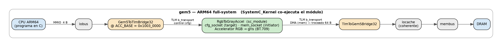
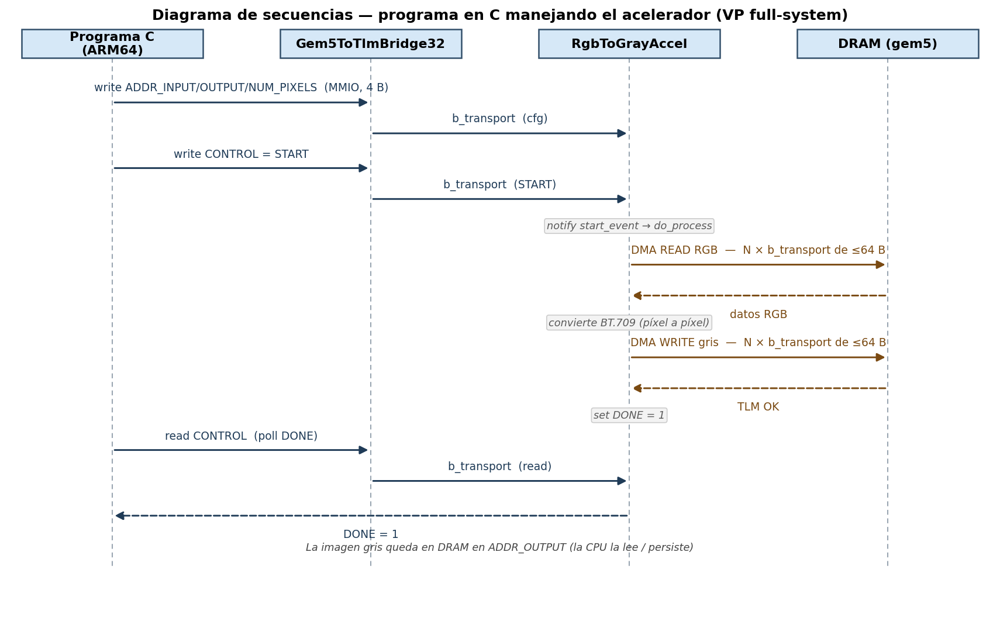

# Tarea 3: Prototipo Virtual en gem5 (acelerador RGB → gris)

Voy a dejar este readme describiendo el trabajo de P4 (yo, Marco) para que el compañero que se 
encargue de la integración tome lo que necesite para el readme final.

Prototipo virtual del acelerador RGB → escala de grises integrado a un SoC ARM64
simulado en gem5, comunicándose por TLM 2.0. El acelerador es el mismo modelo
SystemC de la Tarea 2; aquí se adapta como periférico del prototipo virtual y se
construye el puente gem5 ↔ TLM que lo conecta al resto del sistema.

Esta parte corresponde al rol P4: adaptación del acelerador SystemC como periférico
TLM y el puente gem5 ↔ TLM. El SoC ARM64, el programa en C y los scripts de arranque del
VP corresponden a P5; el kernel HLS, a P2/P3.
La integración del programa en C tuvo más complicaciones de lo esperado, así que dejé un 
pequeño programa de ejemplo para hacerle la vida un poco más fácil a P5. 

---

## Topología de integración

La topología que se utilizó corre SystemC dentro de gem5: gem5 es el ejecutable de más alto
nivel y hospeda un kernel SystemC que agenda el acelerador. gem5 y SystemC intercambian
transacciones a través de dos puentes (`*Bridge`), no por `sc_main`.



*(fuente regenerable: `img/topologia.dot` → `dot -Tpng`; versión vectorial en `img/topologia.svg`)*

- El acelerador tiene dos interfaces: `cfg_socket` (target, recibe la configuración por
  MMIO) y `mem_socket` (initiator, hace DMA a la memoria).
- Cada interfaz cruza la frontera gem5-SystemC por un puente distinto:
  - `Gem5ToTlmBridge32`: gem5 es el iniciador (la CPU escribe registros), TLM el target.
  - `TlmToGem5Bridge32`: TLM es el iniciador (el acelerador hace DMA), gem5 el target.
- El ancho de los sockets y puentes es de 32 bits. Coincide con los sockets del acelerador
  (`simple_target/initiator_socket` con ancho por defecto).
- La interfaz de memoria pasa por la caché coherente `iocache` (la jerarquía de caché stdlib la
  inserta entre el iobus y el membus). Esto da coherencia con las caches del CPU, pero nos obliga
  a trocear el DMA a ≤64 B (la línea de caché): una caché de gem5 aborta si una transacción la
  cruza. Ver la sección de transacciones y `accelerator.h::ram_access`.

---

## Organización de los módulos del VP

```
tarea3_vp/
  vp_accel/                 # PERIFÉRICO (entregable)
    accelerator.h           #   acelerador RGB→gris (SystemC, igual que Tarea 2)
    rgb_to_gray.h           #   conversión BT.709 (compartida DUT/golden)
    ram.h                   #   RAM SystemC (solo para el smoke test standalone)
    sc_rgb2gray.hh/.cc      #   wrapper: expone cfg_socket/mem_socket como puertos gem5
    RgbToGrayAccel.py       #   SimObject de gem5 (declara los sockets TLM cfg/mem)
    SConscript              #   registro y compilación (via EXTRAS)
  smoke/                    # smoke test standalone (SystemC puro, sin gem5)
    smoke_test.cpp          #   acelerador + ram.h, verifica bit-exact BT.709
  harness/                  # de-risk de la cara de memoria (PRUEBA, no entregable)
    cfg_stimulus.hh/.cc     #   CfgStimulus: estimula los registros (emula el programa C)
    CfgStimulus.py          #   SimObject del estímulo
    hito_a.py               #   config gem5: DMA del acelerador → memoria de gem5 + oráculo
    hito_a-1080p.log        #   evidencia del harness a 1080p (6.2 MB) bit-exact
    SConscript
  fullsystem/               # end-to-end full-system (boot ARM64 + programa en C)
    vp_run.py               #   config: ArmBoard (Ubuntu ARM64) + periférico (solo boot)
    vp_run_test.py          #   config end-to-end: inyecta y corre acctest, verifica
    acctest.c               #   programa en C de referencia (mmap /dev/mem, MMIO+DMA)
    acctest-run.log         #   evidencia del ACCTEST_PASS bit-exact
```

### `RgbToGrayAccel`: el periférico

Es un `sc_module` que contiene el `Accelerator` de la Tarea 2 (composición, sin
reescribir su lógica) y envuelve sus dos sockets con adaptadores que los exponen como
puertos conectables desde el config Python de gem5:

```cpp
class RgbToGrayAccel : public sc_core::sc_module {
    Accelerator accel;                           // el acelerador de la T2
    sc_gem5::TlmTargetWrapper<32>    cfgWrapper;  // accel.cfg_socket → puerto gem5 "cfg"
    sc_gem5::TlmInitiatorWrapper<32> memWrapper;  // accel.mem_socket → puerto gem5 "mem"
};
```

El `SimObject` (`RgbToGrayAccel.py`) declara los puertos como sockets TLM:

```python
cfg = TlmTargetSocket(32, "registros de control (MMIO desde el ARM64)")
mem = TlmInitiatorSocket(32, "DMA a la memoria de gem5")
```

Se compila dentro de gem5 sin tocar el árbol de fuentes, con:

```bash
scons build/ARM/gem5.opt EXTRAS=<ruta>/vp_accel[:<ruta>/harness] -j$(nproc)
```

gem5 v25.1 incluye SystemC/TLM estándar por defecto (`Gem5ToTlmBridge*` / `TlmToGem5Bridge*`
ya vienen en `build/ARM/gem5.opt`), así que `accelerator.h` compila casi sin cambios.

---

## Mapa de memoria de los registros

El acelerador expone cuatro registros de 32 bits a partir de `ACC_BASE = 0x1003_0000`
(definido en `accelerator.h`). Se acceden por escrituras/lecturas MMIO de exactamente
4 bytes; el modelo rechaza longitudes distintas de 4 y transacciones con `byte_enable`.

| Dirección       | Tamaño | Registro     | Acceso | Descripción                                        |
|-----------------|--------|--------------|--------|----------------------------------------------------|
| `0x1003_0000`   | 4 B    | `CONTROL`    | R/W    | Escritura: bit0 = `START`. Lectura: bit0 = `DONE`. |
| `0x1003_0004`   | 4 B    | `ADDR_INPUT` | R/W    | Dirección física de la imagen RGB de entrada.      |
| `0x1003_0008`   | 4 B    | `ADDR_OUTPUT`| R/W    | Dirección física de la imagen gris de salida.      |
| `0x1003_000C`   | 4 B    | `NUM_PIXELS` | R/W    | Cantidad de píxeles a procesar.                    |

Notas:
- Base MMIO `0x1003_0000`: en Tarea 2 era `0x4000_0000`, pero esa dirección choca con la
  ventana PCI de `VExpress_GEM5_Foundation`. Se ubica en la región "gem5-specific peripherals"
  (CS5, `0x1000_0000-0x13ff_ffff`), libre y ya ruteada al bus de I/O. El puente entrega la
  dirección absoluta, por lo que `ACC_BASE` debe igualar la base mapeada en el config.
- Las direcciones de los registros (`ADDR_INPUT`/`ADDR_OUTPUT`) son de 32 bits: los
  búferes de imagen deben ubicarse en los primeros 4 GiB del espacio físico de gem5.
- `START` se dispara escribiendo `1` en `CONTROL`; el acelerador limpia `DONE` al iniciar
  y lo pone en `1` al terminar. El programa en C hace *polling* de `DONE`.

---

## Formato de las transacciones TLM

Todas las transacciones usan `tlm::tlm_generic_payload` en modo loosely-timed
(`b_transport`). Cada transacción lleva comando, dirección, puntero a datos, longitud,
ancho de streaming y estado de respuesta.

Interfaz de control (`cfg_socket`, target): accesos MMIO de la CPU, palabra de 4 bytes:

| Origen        | Comando            | Dirección       | Contenido               |
|---------------|--------------------|-----------------|-------------------------|
| CPU (prog. C) | `TLM_WRITE_COMMAND`| `ACC_BASE+0x04` | Dirección de entrada    |
| CPU (prog. C) | `TLM_WRITE_COMMAND`| `ACC_BASE+0x08` | Dirección de salida     |
| CPU (prog. C) | `TLM_WRITE_COMMAND`| `ACC_BASE+0x0C` | Cantidad de píxeles     |
| CPU (prog. C) | `TLM_WRITE_COMMAND`| `ACC_BASE+0x00` | Orden de inicio (`START`)|
| CPU (prog. C) | `TLM_READ_COMMAND` | `ACC_BASE+0x00` | Estado (`DONE`)         |

Interfaz de memoria (`mem_socket`, initiator): DMA del acelerador a la DRAM de gem5:

| Origen     | Comando            | Dirección de inicio | Contenido total (1080p) | Nº de transacciones (troceadas a 64 B) |
|------------|--------------------|---------------------|-------------------------|-----------------------------------------|
| Acelerador | `TLM_READ_COMMAND` | `ADDR_INPUT`        | RGB, 3 B/píxel (~6.2 MB)| ~97 000 (⌈6.2 MB / 64 B⌉)               |
| Acelerador | `TLM_WRITE_COMMAND`| `ADDR_OUTPUT`       | gris, 1 B/píxel (~2.0 MB)| ~32 000 (⌈2.0 MB / 64 B⌉)              |

El acelerador no hace una sola transacción por imagen sino trocea cada acceso en bloques
de ≤64 B alineados a la línea de caché. El motivo es que en el prototipo virtual el DMA atraviesa la
caché coherente `iocache`, y una caché de gem5 aborta
(`BaseCache::satisfyRequest: getOffset + getSize <= blkSize`) si una transacción cruza su línea
de 64 B. (Contra `ram.h`/`SimpleMemory` —sin caché— una sola `b_transport` de ~6.2 MB bastaba,
y así lo hace el harness; con caché coherente el troceo es obligatorio. Es, asumo, la "adaptación
adicional" que anticipa el enunciado.) `ram_access` (en `accelerator.h`) es el bucle de troceo:

```cpp
// ram_access: parte [addr, addr+len) en trozos que no cruzan la línea de 64 B.
unsigned done = 0;
while (done < len) {
    uint64_t a     = addr + done;
    unsigned chunk = CACHE_LINE - (a % CACHE_LINE);   // hasta el borde de línea (64 B)
    if (chunk > len - done) chunk = len - done;
    tlm::tlm_generic_payload trans;
    sc_time delay = SC_ZERO_TIME;
    trans.set_command(cmd);                 // READ (RGB) o WRITE (gris)
    trans.set_address(a);
    trans.set_data_ptr(buf + done);
    trans.set_data_length(chunk);           // ≤ 64 B
    trans.set_streaming_width(chunk);
    trans.set_byte_enable_ptr(nullptr);
    trans.set_dmi_allowed(false);
    trans.set_response_status(tlm::TLM_INCOMPLETE_RESPONSE);
    mem_socket->b_transport(trans, delay);
    sc_assert(trans.is_response_ok());       // se comprueba por bloque
    done += chunk;
}
```

> Nota: el troceo a 64 B es fiel — el propio `DmaPort` de gem5 y el DMA coherente en hardware
> real transfieren en unidades de línea de caché. Aunque 1080p son ~130 000 transacciones, en la
> práctica no es un cuello de botella: cada una es un acceso atómico rápido (medido: el DMA de
> 1080p añade ~0 s de reloj vs una imagen chica). El costo del VP full-system es el boot de Linux,
> no el DMA.

---

## Diagrama de secuencias

Flujo end-to-end del prototipo virtual: el programa en C sobre el ARM64 configura el
acelerador por MMIO; el acelerador lee la imagen por DMA, la convierte y la escribe de
vuelta; la CPU detecta el fin por *polling* de `DONE`.



*(fuente regenerable: `img/secuencia.py` → `python3 secuencia.py`; versión vectorial en `img/secuencia.svg`)*

---

## Estado de verificación

| Componente | Verificación | Estado |
|---|---|---|
| Wrapper `RgbToGrayAccel` | Compila y se instancia en gem5 con sus puertos `cfg`/`mem` | LISTO |
| Núcleo del acelerador | Smoke test standalone bit-exact BT.709 (`smoke/`) | LISTO |
| Cara de memoria (DMA + puente) | `harness/hito_a.py`: DMA a memoria de gem5 bit-exact a 16 px y 1080p (6.2 MB) | LLISTO |
| End-to-end full-system | Programa en C real sobre ARM64 Linux maneja el acelerador por MMIO+DMA, bit-exact (`fullsystem/`, `acctest-run.log`) | LISTO |

El end-to-end (`fullsystem/vp_run_test.py` + `acctest.c`) demuestra la cadena completa: la CPU
ARM64 corre un programa en C que hace `mmap` de los registros, pokea el control por MMIO (por el
`Gem5ToTlmBridge32`), y lee el resultado del DMA — `ACCTEST_PASS ... bit-exact` (ver
`fullsystem/acctest-run.log`). El harness `hito_a.py` fue el paso previo de de-risk (estimula la
cara de control desde SystemC); el programa en C es la validación real.

> Troceo del DMA (importante): en el prototipo virtual el DMA del acelerador atraviesa la
> caché coherente de gem5, que no acepta una transacción que cruce su línea (64 B). Por eso
> `accelerator.h::ram_access` trocea cada acceso en bloques ≤64 B alineados. Contra
> `ram.h`/`SimpleMemory` (sin caché) bastaba una sola transacción; con caché coherente el troceo
> es obligatorio — es la "adaptación adicional" que anticipa el enunciado.
