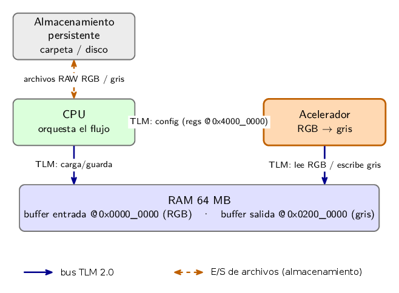
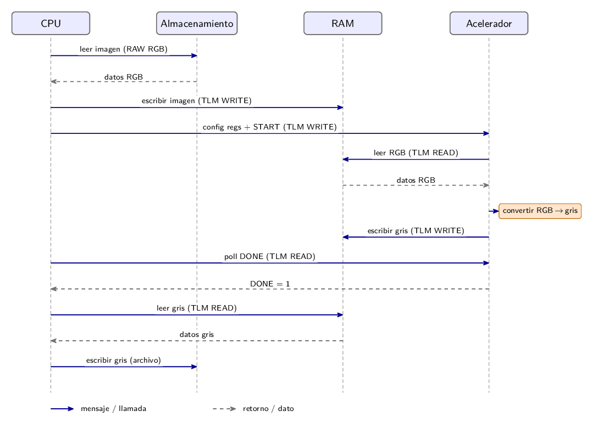

# Tarea 2 (EC2) — Modelo SystemC / TLM 2.0

Modelo a nivel de transacciones de un sistema **CPU + RAM (64 MB) + almacenamiento
persistente + acelerador** de imagen (RGB → escala de grises), descrito en
**SystemC** con comunicación **TLM 2.0**.

Este directorio es **autocontenido**: instala y compila sus propias dependencias
en `tools/`, sin afectar otras tareas ni el proyecto. Cada tarea del curso tiene
su propio entorno aislado.

---

## Requisitos

- **Ubuntu 24.04** (x86_64). En Windows: WSL2 con Ubuntu. En macOS: VM Linux.
- Permisos `sudo` (solo para instalar paquetes de sistema con `apt`).
- ~150 MB de disco y conexión a internet la primera vez (se descarga y compila
  SystemC).

## Instalación (una sola vez)

```bash
cd tarea_2
./setup.sh
```

Esto:
1. Instala con `apt` lo necesario: `build-essential cmake git curl gtkwave`
   (pide tu contraseña `sudo`; omite los que ya estén).
2. Descarga y compila **SystemC 2.3.4** (incluye **TLM 2.0**) en
   `tools/systemc/`. Tarda ~3 min.

Es seguro re-ejecutarlo: los pasos completados se omiten.

## Activar el entorno (en cada terminal nueva)

```bash
source activate.sh
```

Define `SYSTEMC_HOME` y `LD_LIBRARY_PATH` para esta tarea y aplica el arreglo de
GTKWave en Ubuntu 24.04. La configuración es **por terminal**; no persiste.

> **Tip:** agrega un alias a tu `~/.bashrc`:
> ```bash
> alias t2='cd <ruta-al-repo>/MP6160_grupo_5/tarea_2 && source activate.sh'
> ```

## Verificar la instalación

```bash
cd examples/sanity
make run
```

Salida esperada (una transacción TLM de ida y vuelta):

```
TLM round-trip: escrito 0xdeadbeef, leido 0xdeadbeef   [OK]
Tiempo de simulacion tras 2 transacciones: 20 ns
```

Si ves `[OK]`, SystemC y TLM están bien instalados.

---

## Compilar tu propio módulo

Reutiliza el patrón del Makefile de `examples/sanity/`:

```make
SYSTEMC_HOME ?= $(abspath ../../tools/systemc)
CXXFLAGS = -std=c++17 -I$(SYSTEMC_HOME)/include
LDFLAGS  = -L$(SYSTEMC_HOME)/lib -Wl,-rpath,$(SYSTEMC_HOME)/lib
LDLIBS   = -lsystemc
```

Con `source activate.sh` cargado, `SYSTEMC_HOME` ya está en el entorno y no hace
falta pasarlo a mano.

## Estructura del directorio

```
tarea_2/
  setup.sh               # instalador del entorno (correr una vez)
  activate.sh            # cargar el entorno (source en cada terminal)
  README.md              # este archivo
  .gitignore             # ignora tools/ y artefactos
  include/               # módulos del sistema (header-only)
    cpu.h                #   CPU (P2): orquesta el flujo
    ram.h                #   RAM 64 MB (P3): target TLM + E/S de archivos
    accelerator.h        #   Acelerador (P5): RGB -> gris
    persistent_storage.h #   Almacenamiento (P4): E/S de archivos
    rgb_to_gray.h        #   conversión BT.709 (compartida DUT + golden)
  tests/                 # testbench del sistema + Makefile
    tb_cpu_ram_accel.cpp #   flujo completo + verificación bit-exact
    Makefile
    images/              #   imagen de entrada/salida (input.rgb, output.gray/png)
  docs/                  # diagramas (bloques, secuencias)
  examples/              # sanity (hello_tlm) y demo del acelerador
  articulo/              # informe (plantilla IEEE)
  tools/                 # SystemC compilado — NO se commitea (lo regenera setup.sh)
```

## Organización de los módulos

Cada componente es un `sc_module` header-only en `include/`. Las interfaces TLM 2.0 que los unen:

| Módulo | Archivo | Sockets | Rol |
|---|---|---|---|
| **CPU** (P2) | `cpu.h` | `socket_ram`, `socket_acc` (initiator) | Orquesta el flujo: carga la imagen a RAM, configura el acelerador, espera `DONE` y guarda el resultado. |
| **RAM** (P3) | `ram.h` | `socket_cpu`, `socket_acc` (target) | 64 MB. Almacena la imagen original y la procesada. Ambos sockets comparten el mismo `b_transport`. Expone `load_from_file`/`save_to_file` para la E/S. |
| **Acelerador** (P5) | `accelerator.h` | `cfg_socket` (target), `mem_socket` (initiator) | Recibe la configuración por registros (`cfg_socket`), lee RGB / escribe gris en RAM (`mem_socket`) y convierte con luma BT.709. |
| **Almacenamiento** (P4) | `persistent_storage.h` | — (E/S de archivos) | Lee/escribe la imagen sobre la carpeta local (`read_file`/`write_file`). |
| (compartido) | `rgb_to_gray.h` | — | Conversión RGB→gris BT.709, usada por el acelerador y el modelo de referencia. |

## Diagrama de bloques



CPU↔RAM, CPU↔acelerador y acelerador↔RAM se comunican por **TLM 2.0**; la E/S de archivos
modela el almacenamiento persistente. La RAM ocupa `0x0000_0000–0x03FF_FFFF` y los registros del
acelerador `0x4000_0000`.

## Diagrama de secuencias



## Mapa de Memoria

El espacio de direcciones del sistema se divide de la siguiente manera. La comunicación se realiza a través de un bus TLM que enruta las transacciones al componente correspondiente según la dirección.

| Rango de Direcciones      | Tamaño | Componente          | Dueño | Descripción                                          |
|---------------------------|--------|---------------------|-------|------------------------------------------------------|
| `0x0000_0000-0x03FF_FFFF` | 64 MB  | **Memoria RAM**     | P3    | Espacio de trabajo principal.                        |
| `↳ 0x0000_0000`           | ~6 MB  | Buffer de Entrada   | -     | Imagen RAW RGB 1080p (1920x1080x3 bytes).             |
| `↳ 0x0200_0000`           | ~2 MB  | Buffer de Salida    | -     | Imagen en escala de grises (1920x1080x1 byte).        |
| `0x4000_0000-0x4000_000F` | 16 B   | **Acelerador Regs** | P5    | Registros de control para el acelerador.             |
| `↳ 0x4000_0000`           | 4 B    | `CONTROL`           | -     | Registro de control (e.g., `START=1`, `DONE` flag).    |
| `↳ 0x4000_0004`           | 4 B    | `ADDR_INPUT`        | -     | Dirección base del buffer de entrada en RAM.         |
| `↳ 0x4000_0008`           | 4 B    | `ADDR_OUTPUT`       | -     | Dirección base del buffer de salida en RAM.          |
| `↳ 0x4000_000C`           | 4 B    | `NUM_PIXELS`        | -     | Cantidad de píxeles a procesar.                      |

El acceso al **Almacenamiento Persistente** (P4) no está mapeado en memoria. Se modela a través de llamadas a funciones directas (por ejemplo, `ram.load_from_file(...)`) que simulan la E/S del disco, orquestadas por la CPU (P2).

## Formato de las transacciones

Toda la comunicación usa el transporte bloqueante de TLM 2.0 (`b_transport`) con un
`tlm_generic_payload`. El *initiator* fija los campos y el *target* fija el `response_status`.

| Campo | Valor |
|---|---|
| `command` | `TLM_READ_COMMAND` / `TLM_WRITE_COMMAND` |
| `address` | dirección del mapa de sistema (RAM: offset directo; acelerador: `ACC_BASE` + offset de registro) |
| `data_ptr` | puntero al buffer del initiator |
| `data_length` | 4 bytes para registros; tamaño del bloque para datos de imagen |
| `streaming_width` | igual a `data_length` (sin streaming) |
| `byte_enable_ptr` | `nullptr` (sin byte-enables) |
| `response_status` | el initiator lo inicia en `TLM_INCOMPLETE_RESPONSE` |

Hay **dos tipos** de transacción:

1. **Configuración (CPU → acelerador, `cfg_socket`):** READ/WRITE de **4 bytes** a
   `ACC_BASE + offset` (registros `CONTROL`, `ADDR_INPUT`, `ADDR_OUTPUT`, `NUM_PIXELS`). El
   acelerador exige `data_length == 4` y `byte_enable == nullptr`; suma 5 ns de retardo.
2. **Datos (acelerador ↔ RAM y CPU ↔ RAM):** READ/WRITE de bloques (la imagen) por `memcpy`.
   La RAM valida `address + length ≤ 64 MB`, `byte_enable == nullptr` y `streaming_width ≥ length`;
   suma 10 ns por acceso.

**Respuestas del target:** `TLM_OK_RESPONSE` en éxito; `TLM_ADDRESS_ERROR_RESPONSE` si la dirección
queda fuera de rango (o hay byte-enables / `streaming_width` insuficiente). El modelo es
*loosely-timed*: el retardo se acumula en el argumento `delay`.

## Compilar y correr el sistema

```bash
source activate.sh
cd tests
make run          # compila tb_cpu_ram_accel y corre el flujo completo + verificación
```

El testbench corre dos trabajos: una imagen sintética 8×8 (sanity con colores conocidos) y la
imagen real **1080p** desde `tests/images/input.rgb`. Si necesitas (re)generar la entrada desde
un JPG de 1920×1080:

```bash
# (opcional) regenerar la entrada RAW desde un JPG de 1920x1080:
convert foto.jpg -resize 1920x1080\! -depth 8 rgb:tests/images/input.rgb
# versiones visibles (PNG) de entrada y salida (para el README):
convert -size 1920x1080 -depth 8 rgb:tests/images/input.rgb   tests/images/input.png
convert -size 1920x1080 -depth 8 gray:tests/images/output.gray tests/images/output.png
```

## Resultados

Se ejecutó el flujo completo (disco → RAM → acelerador → RAM → disco) sobre una imagen real
RAW RGB de **1920×1080** (`tests/images/input.rgb`, 6 220 800 bytes). El acelerador convierte
RGB→gris (BT.709) y la CPU guarda el resultado (`tests/images/output.gray`, **2 073 600 bytes**).

**Correctitud (bit-exact).** La salida se comparó byte a byte contra un modelo de referencia
(*golden*) con la misma conversión BT.709: **2 073 600 / 2 073 600 píxeles correctos (0
discrepancias).** La prueba de sanidad 8×8 con colores conocidos también pasa (64/64):

| Color | RGB | Gris (BT.709) |
|-------|-----|---------------|
| Negro  | (0, 0, 0)       | 0   |
| Blanco | (255, 255, 255) | 255 |
| Rojo   | (255, 0, 0)     | 54  |
| Verde  | (0, 255, 0)     | 182 |
| Azul   | (0, 0, 255)     | 18  |

**Resultado visual** (entrada a color → salida en escala de grises):

| Entrada RGB (1080p) | Salida en escala de grises |
|:---:|:---:|
|  |  |

**Métricas de simulación (1080p).** Transacciones del acelerador: 1 lectura (6 220 800 B) + 1
escritura (2 073 600 B); configuración por la CPU: 4 escrituras de registro; latencia hasta `DONE`:
≈ 2 073 610 ns simulados (el acelerador modela ~1 ns/píxel más los accesos a memoria).

## Por qué `tools/` no se commitea

SystemC se compila desde el código fuente y sus binarios no son relocalizables
(rpath embebido). Subirlo al repo lo rompería en otra máquina. En su lugar, cada
integrante clona el repo y corre `./setup.sh` para reconstruirlo localmente.

---

## Artículo (LaTeX) — que todos usemos lo mismo

El informe está en `articulo/` (plantilla IEEE `conference`). LaTeX **no** se
instala por tarea como SystemC: TeX Live es un paquete de sistema. Para que todos
compilemos con las mismas herramientas, usen **una** de estas dos opciones.

### Opción A — TeX Live local (recomendada)

```bash
sudo apt update
sudo apt install -y \
    texlive-latex-base texlive-latex-recommended texlive-latex-extra \
    texlive-fonts-recommended texlive-science texlive-publishers latexmk
```

Cubre todo lo que usa el artículo: `IEEEtran` (texlive-publishers), `algorithmic`
(texlive-science), `cite`, `amsmath/amssymb/amsfonts`, `graphicx`, `textcomp`,
`xcolor`. Si en algún momento falta un paquete, `sudo apt install texlive-full`
lo trae todo (~5 GB).

Compilar:

```bash
cd articulo
make          # genera conference_101719.pdf
make watch    # recompila automáticamente al guardar (latexmk -pvc)
make clean    # borra los artefactos de compilación
```

### Opción B — Overleaf (cero instalación)

Suban la carpeta `articulo/` a un proyecto de Overleaf. Incluye `IEEEtran.cls`,
así que compila sin configurar nada y permite edición simultánea.

> Los artefactos de LaTeX (`.aux`, `.log`, `.pdf` generado, etc.) están en el
> `.gitignore` de `articulo/`: no se commitean, se regeneran con `make`.

---

## Problemas comunes

| Problema | Solución |
|---|---|
| `source activate.sh` dice "SystemC no encontrado" | Aún no corriste `./setup.sh`, o `tools/` se borró. |
| Al compilar: `systemc.h: No such file or directory` | Falta `source activate.sh` en esta terminal (o `SYSTEMC_HOME` mal). |
| Al ejecutar: `libsystemc.so: cannot open shared object file` | Idem: `source activate.sh` define `LD_LIBRARY_PATH`. |
| GTKWave: `__libc_pthread_init ... GLIBC_PRIVATE` | Ejecútalo tras `source activate.sh`; o `unset LD_LIBRARY_PATH; gtkwave archivo.vcd`. |
| `setup.sh` falla en `apt` por `sudo` | Instala a mano: `sudo apt install build-essential cmake git curl gtkwave`. |


## Declaración sobre el uso de inteligencia artificial
Para el presente trabajo se hizo uso de la herramienta Claude Code de forma conversacional para:
- Generar un resumen de conceptos relacionados a system C utilizando el standard IEEE Std 1666‐2023
- Revisión y sugerencias de código (por medio del comando code-review)
- Generación de la estructura básica del readme